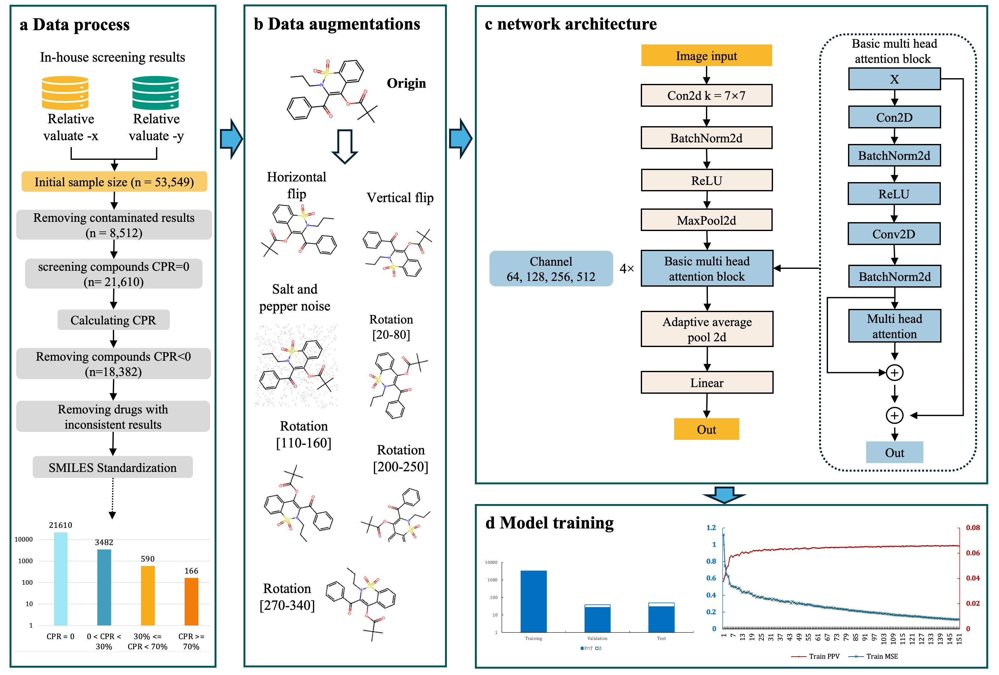

# H1N1_SMCseeker



## Shred the data set (train, test, val)
```shell
python main.py --in arg_split.txt
```

## Perform data enhancement on the data
```shell
python main.py --in arg_enhance.txt
```

## Train the data
```shell
python main.py --in arg_finetune.txt
```

## test data
```shell
python main.py --in arg_evaluate.txt
```

## installation environment
```shell
virtualenv venv
source ./venv/bin/activate
pip install -r requirements.txt
```
